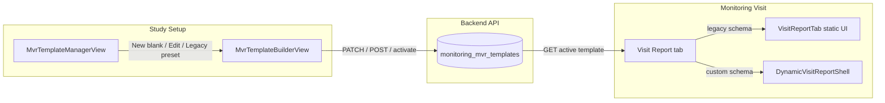

# MVR Template Builder — How It Works

This document explains the **Monitoring Visit Report (MVR) template builder** in the CRM frontend: where it lives, how templates are stored, how drag-and-drop works today, and what to evaluate if you want a richer builder experience.

---

## Where to find it

| Entry point | Path |
|-------------|------|
| UI | **Study Setup → MVR Template** tab |
| Studio shell | `src/components/mon/components/views/MvrTemplateStudio.tsx` |
| Template list | `MvrTemplateManagerView.tsx` |
| Builder (DnD canvas) | `MvrTemplateBuilderView.tsx` |
| Runtime form (CRA fills report) | `visit-detail/DynamicVisitReportShell.tsx` |
| Built-in legacy MVR (11 sections) | `visit-detail/VisitReportTab.tsx` + `legacyStaticMvrTemplateSchema.ts` |

---

## High-level flow



1. **Admin** designs a template in the builder (toolbox → canvas → field properties).
2. Template JSON is saved to Postgres table `monitoring_mvr_templates` (`schema` column, JSONB).
3. One template per org can be marked **Live** (`is_active = true`).
4. On a visit, the report tab loads the active template and renders either:
   - **Legacy static UI** — if schema matches the built-in standard MVR layout, or
   - **Dynamic shell** — flat list of fields from `schema.fields`.

---

## Template schema (what gets saved)

Defined in `src/components/mon/types/mvrTemplate.ts`:

```ts
interface MvrTemplateSchema {
  fields: MvrFieldDef[];
  layout?: string; // e.g. "legacy-static-standard" for built-in MVR clone
}

interface MvrFieldDef {
  id: string;           // payload key in saved visit report
  type: MvrFieldType;
  label: string;
  content?: string;     // section instructions
  placeholder?: string;
  required?: boolean;
  options?: string[];   // radio / select / multiselect
  columns?: { id: string; label: string }[]; // table
}
```

**Field types supported today**

| Type | Builder label | Runtime behavior |
|------|---------------|------------------|
| `section` | Section / instructions | Heading + instructional text (not submitted) |
| `text` | Short text | Single-line input |
| `textarea` | Long text | Multi-line input |
| `number` | Number | Numeric input |
| `date` | Date | Native date input |
| `checkbox` | Checkbox | Boolean |
| `radio` | Radio (Y/N/N/A) | Single choice |
| `select` | Dropdown | Single select |
| `multiselect` | Multi-select | Multiple checkboxes |
| `table` | Dynamic table | Repeatable rows; values stored as `fieldId: Row[]` |

Visit report answers are stored in the visit report payload keyed by **`field.id`** (e.g. `fld_abc123` or `legacy_s1_study_title`).

---

## Builder UI layout

Three columns (desktop):

```
┌─────────────┬──────────────────────────┬──────────────────┐
│  Toolbox    │  Canvas (drop zone)      │  Field properties │
│  (drag from)│  (sortable fields)       │  (edit selected)  │
└─────────────┴──────────────────────────┴──────────────────┘
```

- **Toolbox** — palette of field types; drag onto canvas.
- **Canvas** — ordered list of fields; click to select; grip handle to reorder; trash to remove.
- **Field properties** — label, placeholder, options, table columns, required flag, advanced field ID.

Also: **Builder / Preview** toggle, template name, quick-switch between saved templates, **Save draft** / **Save** / **Set live**.

---

## Drag-and-drop — current implementation

### Library

| Package | Version | Role |
|---------|---------|------|
| `@dnd-kit/core` | ^6.3 | `DndContext`, drag sensors, drop targets |
| `@dnd-kit/sortable` | ^10 | Reorder fields on canvas (`arrayMove`) |
| `@dnd-kit/utilities` | ^3.2 | CSS transform helpers |

All DnD logic is in **`MvrTemplateBuilderView.tsx`**.

### Two drag sources

1. **Toolbox → Canvas** (`useDraggable` on toolbox chips)
   - Drag id: `toolbox-{type}` (e.g. `toolbox-text`)
   - Data: `{ source: "toolbox", fieldType: "text" }`
   - On drop: `createField(fieldType)` is inserted before the hovered field, or appended if dropped on empty canvas (`CANVAS_ID = "mvr-canvas-drop"`).

2. **Canvas reorder** (`useSortable` on each field row)
   - Drag id: `field.id`
   - Data: `{ source: "field" }`
   - On drop: `arrayMove(fields, oldIndex, newIndex)`

### Drop feedback

- Canvas border highlights when dragging over (`useDroppable` on `CanvasDropShell`).
- Blue line indicator before target field (`showLineBeforeField` + `dragState.overId`).
- `PointerSensor` with `activationConstraint: { distance: 6 }` — avoids accidental drags on click.

### What DnD does **not** support today

- Nested sections / columns / multi-column layouts
- Drag between sections (only a flat list)
- Drag-and-drop **within** table column editor (columns are text inputs only)
- Undo/redo
- Copy/paste fields (duplicate whole template only)
- Touch-optimized drag handles (basic pointer sensor only)
- Keyboard-only reordering
- Drag overlay / ghost preview component (`DragOverlay` from dnd-kit is unused)

---

## Template lifecycle

| State | `lifecycleStatus` | `isActive` | Meaning |
|-------|-------------------|------------|---------|
| Draft | `draft` | `false` | Work in progress; not used on visits |
| Saved | `published` | `false` | Valid template; not live yet |
| Live | `published` | `true` | Active for new/editing visit reports in org |

**API routes** (`Backend-CRM/app/modules/monitoring/routes/mvr_templates.py`):

| Action | Method | Endpoint |
|--------|--------|----------|
| List | GET | `/api/monitor/mvr-templates` |
| Get active | GET | `/api/monitor/mvr-templates/active` |
| Create draft | POST | `/api/monitor/mvr-templates/drafts` |
| Save / patch | PATCH | `/api/monitor/mvr-templates/{id}` |
| Publish | POST | `/api/monitor/mvr-templates/{id}/publish` |
| Set live | POST | `/api/monitor/mvr-templates/{id}/activate` |
| Duplicate | POST | `/api/monitor/mvr-templates/{id}/duplicate` |

Frontend client: `src/components/mon/services/monitorService.ts`.

---

## Legacy vs custom templates

| | **Standard MVR (legacy)** | **Custom template (blank builder)** |
|--|---------------------------|-------------------------------------|
| Created via | “From standard layout” in manager | “New blank template” |
| Schema | `legacyStaticMvrTemplateSchema.ts` (~100+ fields, `legacy_*` ids) | User-defined `fields[]` |
| Runtime UI | `VisitReportTab.tsx` (rich sections, tables, Y/N comments) | `DynamicVisitReportShell.tsx` (generic renderer) |
| Detection | `isLegacyStaticMvrTemplateSchema()` | Everything else with non-empty `fields` |

Custom templates are simpler at runtime: one field after another, no section-specific business rules (ICF table column types, signature grid, etc.) unless you model them as generic table/radio fields.

---

## Key files reference

```
Frontend-CRM/src/components/mon/
├── types/mvrTemplate.ts              # Types + field type union
├── legacyStaticMvrTemplateSchema.ts  # Built-in 11-section MVR as JSON schema
├── services/monitorService.ts        # API calls
├── components/views/
│   ├── MvrTemplateStudio.tsx         # Manager ↔ Builder router
│   ├── MvrTemplateManagerView.tsx    # List, delete, set live
│   ├── MvrTemplateBuilderView.tsx    # ★ DnD builder (toolbox/canvas/properties)
│   ├── MvrTemplateCanvasPreview.tsx  # Read-only preview tab
│   ├── MvrTemplateFieldPreview.tsx   # Single-field mock in builder
│   └── visit-detail/
│       ├── DynamicVisitReportShell.tsx  # Runtime for custom templates
│       └── VisitReportTab.tsx           # Runtime for legacy standard MVR

Backend-CRM/app/modules/monitoring/routes/mvr_templates.py
```

---

## Evaluating better drag-and-drop options

Use this section when comparing libraries or form builders.

### Stay on @dnd-kit (incremental improvement)

**Pros:** Already integrated; small bundle; accessible; maintained; works with React 18+.  
**Improvements without switching library:**

- Add `DragOverlay` for a floating ghost while dragging
- Use `KeyboardSensor` + `sortableKeyboardCoordinates` for a11y
- Use `@dnd-kit/modifiers` for axis lock / snap
- Split canvas into **section drop zones** (multiple `useDroppable` ids) for grouped layouts
- Extract DnD into `useMvrBuilderDnD()` hook for easier testing

**Good fit if:** You only need a **flat or lightly grouped** form list, like today.

### Alternative React DnD libraries

| Library | Best for | Notes |
|---------|----------|-------|
| **@dnd-kit** (current) | Sortable lists, toolbox → canvas | Modern, composable; no built-in form builder |
| **react-dnd** | Complex custom drag layers | More boilerplate; HTML5/backend backends |
| **hello-pangea/dnd** | Drop-in for react-beautiful-dnd | Fork of deprecated RBD; list reorder only |
| **Pragmatic drag and drop** (Atlassian) | Performance at scale | Lower-level; more setup |

### Full visual form builders (bigger change)

If you need **multi-column layouts, conditional logic, rich sections**, consider embedding or learning from:

| Product / lib | Drag-drop UX | Integration effort |
|---------------|--------------|-------------------|
| **SurveyJS Creator** | Mature form designer | License; map output JSON → `MvrFieldDef` or replace schema |
| **Form.io** | Schema-driven builder | Heavier; self-host or cloud |
| **Craft.js** | Page builder (React components) | Build custom blocks per MVR field type |
| **GrapeJS** | Web page builder | Less form-native |
| **JSON Schema Form designers** | Standards-based | May not match table/Y-N comment patterns |

**Migration cost:** Any replacement must still produce (or convert to) `MvrTemplateSchema.fields` **or** you version the payload format and update `DynamicVisitReportShell` + review page + backend validation in `post_visit_and_report.py`.

### Recommendation matrix

| Your goal | Suggested direction |
|-----------|---------------------|
| Smoother reorder + better visual feedback | Extend **@dnd-kit** (`DragOverlay`, touch sensors) |
| Section groups (drag fields into Section 1, Section 2, …) | **@dnd-kit** multiple droppables + `section` parent ids in schema |
| Multi-column rows, conditional show/hide | Schema extension + custom builder UI, or **SurveyJS** / **Craft.js** |
| WYSIWYG identical to final PDF | Separate concern — builder defines *fields*; PDF/DOCX uses visit payload |

---

## Local development

1. Start stack: `docker compose up` in `Backend-CRM`
2. Open app → **Study Setup** → **MVR Template**
3. Create **New blank template** or **From standard layout**
4. After **Save**, use **Set live** in manager to point visit reports at the template
5. Open a monitoring visit → **Visit Report** tab to see runtime behavior

---

## Extending the builder (checklist)

When adding a new field type:

1. Add to `MvrFieldType` in `mvrTemplate.ts`
2. Add toolbox entry in `TOOLBOX` + `createField()` in `MvrTemplateBuilderView.tsx`
3. Render preview in `MvrTemplateFieldPreview.tsx`
4. Render runtime input in `DynamicVisitReportShell.tsx`
5. Render read-only review in `MvrDynamicReviewReportBody.tsx` (if used)
6. Optional: backend validation in `_mvr_template_field_input_ids` (`post_visit_and_report.py`)

When changing DnD behavior, start in `MvrTemplateBuilderView.tsx` only — runtime and API stay unchanged if `MvrFieldDef` shape is stable.

---

## Related docs

- Monitoring API tests: `Backend-CRM/tests/monitoring/`
- DB table: `monitoring_mvr_templates` in `migrations/schema/monitoring_tab_full_schema.sql`
- Visit report payload merge: `visitReportFormDefaults.ts` (legacy) vs dynamic payload keys from `field.id`
